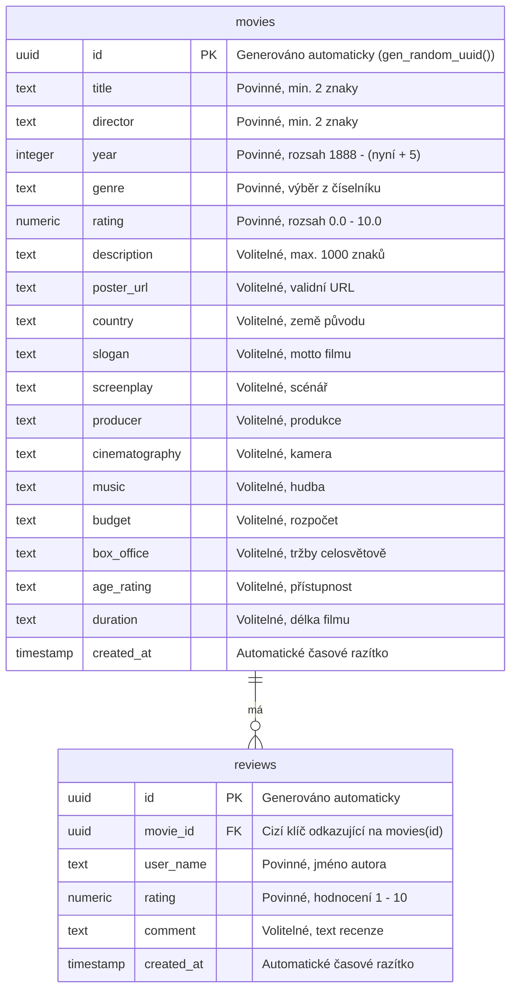
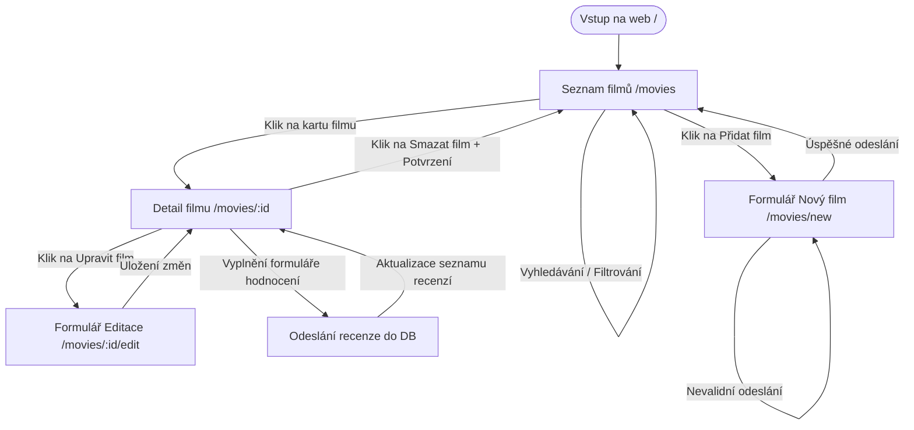

# CineVault – Filmová knihovna s integrací Supabase API
## Technická dokumentace a návrh webové aplikace

**Autoři:** Volodymyr Panovyk, Oleksandr Bukrieiev  
**Třída:** I3C  
**Předmět:** Tvorba webových aplikací  
**Vyučující:** Sergey Kuroedov  
**Školní rok:** 2025/2026  

---

## Obsah
1. **Úvod**
2. **Research (Průzkum trhu)**
3. **Analýza požadavků**
4. **Návrh funkcí systému (Role a User Stories)**
5. **Návrh řešení (Architektura, DB, User Flow)**
6. **Implementace**
7. **Porovnání návrhu a implementace**
8. **Závěr**

---

## 1. Úvod

V dnešní digitální éře čelí filmoví diváci paradoxu nadbytku. Fragmentace trhu streamovacích služeb (Netflix, HBO Max, Disney+, Apple TV+ a další) způsobuje, že je pro běžného uživatele obtížné udržet si přehled o filmech, které již zhlédl, nebo o těch, které se teprve chystá sledovat. Cílem tohoto projektu je vytvořit aplikaci **CineVault**, která slouží jako osobní, nezávislá a uživatelsky přívětivá filmová knihovna. 

Téma projektu bylo vybráno z důvodu vysoké praktické využitelnosti a potřeby demonstrovat moderní webové technologie v praxi. Aplikace poskytuje čisté rozhraní bez reklam, které uživateli umožňuje plnou kontrolu nad jeho daty.

**Cíl aplikace:** 
Hlavním cílem aplikace CineVault je poskytnout uživatelům nástroj pro efektivní správu (CRUD operace) jejich osobního katalogu filmů s možností vyhledávání, filtrování podle žánrů a hodnocení snímků na škále od 0.0 do 10.0.

**Cílová skupina:**
Cílovou skupinou jsou filmoví nadšenci (cinefilové), sběratelé fyzických či digitálních médií a běžní diváci, kteří chtějí mít přehledný digitální deník svých filmových zážitků bez nutnosti sdílení dat na sociálních sítích.

---

## 2. Research (Průzkum trhu)

Před zahájením návrhu a vývoje byla provedena analýza stávajících platforem, které řeší podobnou problematiku. Mezi nejvýznamnější zástupce patří IMDb, Letterboxd a Česko-Slovenská filmová databáze (ČSFD).

### IMDb (Internet Movie Database)
IMDb je největší světová databáze filmů a televizních pořadů. 
* **Výhody:** Obrovské množství dat, detailní biografie tvůrců, integrace s Amazonem, komplexní uživatelské seznamy.
* **Nevýhody:** Uživatelské rozhraní je přeplněné informacemi, obsahuje velké množství reklam a proces přidávání vlastních hodnocení či seznamů je zdlouhavý. Aplikace neumožňuje ukládat specifické osobní poznámky skryté před veřejností.

### Letterboxd
Letterboxd je sociální síť zaměřená výhradně na filmové fanoušky.
* **Výhody:** Vynikající moderní vizuální design, silný sociální aspekt (sdílení recenzí, diskuse), možnost vedení deníku sledování (Diary).
* **Nevýhody:** Platforma je primárně sociální sítí, což nemusí vyhovovat uživatelům hledajícím soukromí. Pokročilé statistiky a filtry jsou navíc zpoplatněny v rámci prémiového členství.

### ČSFD (Česko-Slovenská filmová databáze)
Lokální lídr v oblasti filmových databází v tuzemsku.
* **Výhody:** Rozsáhlá komunita v ČR/SR, kvalitní české a slovenské popisy filmů, hodnocení odrážející lokální vkus.
* **Nevýhody:** Uživatelské rozhraní je morálně zastaralé, web trpí agresivní reklamou a chybí možnost efektivní správy soukromé lokální knihovny s vlastními kategoriemi.

###---

## 3. Analýza požadavků

Na základě cílů aplikace a průzkumu konkurence byly definovány klíčové funkční a nefunkční požadavky na systém.

### Funkční požadavky
1. **Správa záznamů (CRUD):**
   - Vytvoření nového záznamu o filmu s rozšířenými metadaty (název, režisér, rok vydání, žánr, hodnocení, popis, URL plakátu, země původu, slogan, scénář, produkce, kamera, hudba, rozpočet, tržby celosvětově, přístupnost a délka filmu).
   - Zobrazení detailních informací o konkrétním filmu v přehledné strukturované tabulce ("O filmu").
   - Editace jakéhokoliv existujícího záznamu prostřednictvím předvyplněného formuláře.
   - Odstranění filmu z knihovny s potvrzovacím dialogem pro zamezení nechtěného smazání.
2. **Uživatelské recenze a hodnocení:**
   - Možnost psaní uživatelských hodnocení na detailní stránce filmu.
   - Každá recenze vyžaduje jméno autora (přezdívku), číselné hodnocení (1–10 hvězd) and volitelný textový komentář.
   - Dynamické načítání a řazení recenzí od nejnovějších.
3. **Vyhledávání a filtrace:**
   - Fulltextové vyhledávání v reálném čase podle názvu filmu nebo jména režiséra.
   - Filtrování seznamu filmů podle žánrových kategorií.
4. **Validace dat:**
   - Validace vstupů na straně klienta před odesláním do databáze (kontrola délky textu, rozsahů letopočtů, správnosti formátu URL u plakátů, limitů hodnocení).

### Nefunkční požadavky
1. **Responzivita (Mobile-First):** Rozhraní se musí adaptovat na různé šířky displejů (mobilní telefony, tablety, stolní počítače) pro možnost pohodlného prohlížení na cestách.
2. **Výkon a odezva:** Načítání a manipulace s daty musí probíhat asynchronně bez znatelných prodlev (odezva do 200 ms).
3. **Bezpečnost dat:** Využití cloudového úložiště Supabase s definovanými pravidly přístupu k tabulkám (Row Level Security) umožňující veřejný přístup k datům bez nutnosti registrace.
4. **Estetická úroveň:** Použití moderních vizuálních prvků (glassmorphismus, gradienty, tmavý režim, čisté mikroskopické předěly) pro zajištění prémiového uživatelského zážitku.

---

## 4. Návrh funkcí systému (User Stories a role)

Pro správný návrh uživatelského rozhraní a datových toků byly definovány uživatelské role a jejich potřeby formulované pomocí User Stories.

### Uživatelské role
1. **Návštěvník / Uživatel:** Osoba přistupující na web. Vzhledem k otevřené architektuře bez nutnosti přihlášení má plná práva pro prohlížení katalogu, přidávání/úpravu filmů a psaní recenzí.
2. **Administrátor:** Správce systému, který může v databázové konzoli spravovat nebo moderovat nevhodný obsah (v ideálním návrhu).

### Uživatelské scénáře (User Stories)

* **Uživatel (Čtení):**
  > *„Jako uživatel chci mít možnost zobrazit si přehledný seznam filmů v mřížce karet s plakáty, abych měl vizuální přehled o celé sbírce.“*
  
* **Uživatel (Detail filmu a factsheet):**
  > *„Jako uživatel chci na stránce filmu vidět přehlednou tabulku s podrobnými metadaty (země, tvůrci, rozpočet, stopáž), abych získal rychlé a přesné informace o filmu.“*

* **Uživatel (Uživatelské recenze):**
  > *„Jako uživatel chci napsat k filmu své hodnocení a komentář s mým jménem, abych se mohl podělit o své dojmy z filmu s ostatními.“*

* **Uživatel (Vyhledávání a filtrace):**
  > *„Jako uživatel chci vyhledávat filmy podle názvu či režiséra a filtrovat je podle žánrů, abych si mohl vybrat vhodný film pro večerní sledování.“*

* **Uživatel (Zápis s validací):**
  > *„Jako uživatel chci přidat nový film pomocí formuláře, který mě okamžitě upozorní na chyby (např. neplatné URL plakátu), abych uložil pouze konzistentní data.“*

* **Uživatel (Úprava a mazání):**
  > *„Jako uživatel chci mít možnost upravit informace o filmu nebo jej smazat z katalogu, pokud obsahuje chyby nebo byl vložen duplicitně.“*

### Dopad na uživatelské rozhraní a data
Z těchto příběhů vyplývá nutnost vytvořit:
- Dvou sloupcový detail filmu s postranním panelem pro plakát a hlavním blokem pro factsheet a recenze.
- Asynchronní formulář pro hodnocení s validací prázdných polí přímo na detailní stránce filmu.
- Robustní formulář pro filmy s 15 vstupními poli organizovanými do dvousloupcového gridu pro zachování přehlednosti.

---

## 5. Návrh řešení

### Architektura systému
Systém je navržen jako moderní jednostránková/vícestránková webová aplikace na bázi frameworku **Next.js** využívajícího **App Router** (s klientskými komponentami na bázi `'use client'`). Pro ukládání dat slouží bezserverová relační databáze **Supabase** postavená na PostgreSQL.

### Databázový model (ERD)
Aplikace pracuje se dvěma relačními tabulkami: `movies` a `reviews` propojenými vazbou 1:N (jeden film může mít více recenzí).



### Uživatelský průchod aplikací (User Flow)
Následující schéma popisuje průchod uživatele systémem CineVault:



### Návrh uživatelského rozhraní (UI Mockup popis)
* **Hlavní přehled (`/movies`):** V horní části je fixní tmavá navigační lišta s logem a tlačítkem „Přidat film“. Pod ní se nachází ovládací panel (vyhledávací pole a žánrový filtr). Spodní část tvoří responsivní mřížka karet filmů. Každá karta zobrazuje plakát, žánr, průměrné hodnocení a jméno režiséra.
* **Detail filmu (`/movies/[id]`):** Na širokých obrazovkách je rozhraní rozděleno na dva sloupce. Levý sloupec obsahuje tlačítko zpět a plakát filmu. Pravý sloupec obsahuje název filmu s případným sloganem (kurzívou v uvozovkách), základní metadata, textový popis a strukturovanou mřížku „O filmu“ (ve které se nezobrazují prázdná pole). Pod tímto blokem se nachází dvousloupcová sekce recenzí: vlevo je seznam všech uložených recenzí s datem a hodnocením, vpravo je formulář pro rychlé přidání hodnocení.

---

## 6. Implementace

Skutečně realizované řešení plně odpovídá navržené architektuře. Aplikace byla vyvinuta v čistém JavaScriptu za použití moderního Reactu v Next.js.

### Správa dat s využitím Supabase API
Propojení s PostgreSQL databází bylo realizováno pomocí inicializačního souboru `lib/supabase.js`. SQL operace probíhají asynchronně na straně klienta:
- **Čtení filmů:** Využívá metodu `supabase.from('movies').select('*')` řazenou podle data vytvoření.
- **Načítání recenzí:** Provádí se filtrovaným dotazem `supabase.from('reviews').select('*').eq('movie_id', movieId)`.
- **Zápis recenzí:** Odesílá data do tabulky `reviews` pomocí asynchronního insertu `.insert([reviewPayload])`.

### Klientská validace (React Hook Form & Zod)
Formulář v komponentě `components/MovieForm.jsx` využívá integraci `react-hook-form` a validátoru `Zod` pomocí resolveru. Validační schéma `lib/schemas.js` vynucuje integritu dat.

Příklad validačního schématu pro rozšířená metadata filmu:
```javascript
export const movieSchema = z.object({
  title: z.string().trim().min(2).max(100),
  director: z.string().trim().min(2).max(100),
  year: z.coerce.number().int().min(1888).max(new Date().getFullYear() + 5),
  genre: z.string().min(1),
  rating: z.coerce.number().min(0).max(10),
  description: z.string().max(1000).optional().or(z.literal('')),
  poster_url: z.string().url().optional().or(z.literal('')),
  country: z.string().max(100).optional().or(z.literal('')),
  slogan: z.string().max(200).optional().or(z.literal('')),
  screenplay: z.string().max(200).optional().or(z.literal('')),
  producer: z.string().max(200).optional().or(z.literal('')),
  cinematography: z.string().max(100).optional().or(z.literal('')),
  music: z.string().max(100).optional().or(z.literal('')),
  budget: z.string().max(50).optional().or(z.literal('')),
  box_office: z.string().max(50).optional().or(z.literal('')),
  age_rating: z.string().max(20).optional().or(z.literal('')),
  duration: z.string().max(30).optional().or(z.literal(''))
});
```
Metoda `z.coerce.number()` zajišťuje správné přetypování textových hodnot z HTML inputů na čísla. Pokud uživatel zadá neplatná data, formulář zablokuje odeslání a pod konkrétním polem vykreslí lokalizované chybové hlášení.

---

## 7. Porovnání návrhu a implementace

Mezi původním ideálním návrhem a finální implementací došlo k logickým změnám a vylepšením.

### Odchylky od původního návrhu
1. **Absence uživatelské autentizace (přihlašování):** Původní ideální návrh počítal s registrací uživatelů. Během vývoje se však ukázalo, že pro účely rychlé prezentace a zamezení zbytečného tření (nutnost registrace pro každého zkoušejícího) je vhodnější zachovat platformu plně otevřenou a přístupnou anonymně.
2. **Přidání systému recenzí jako kompenzace:** Abychom kompenzovali chybějící autentizaci a zachovali vysokou interaktivitu aplikace, přidali jsme do implementace možnost psaní recenzí k jednotlivým filmům. Tím se z pasivní knihovny stal interaktivní komunitní katalog.
3. **Rozšíření metadat (Factsheet):** Původní verze databáze obsahovala pouze základní údaje o filmu. Abychom se přiblížili profesionálním filmovým databázím (IMDb, ČSFD), rozšířili jsme model o 10 nových parametrů (slogan, scénář, rozpočet, stopáž atd.) a na detailní stránce implementovali elegantní mřížku „O filmu“.

### Kompromisy
* **Ruční zadávání odkazů na plakáty:** V ideální aplikaci by měl být implementován vyhledávač, který po zadání názvu sám vyhledá plakát přes externí API (TMDb). Z důvodu limitů bezplatných API klíčů byl zvolen kompromis – uživatel zadává odkaz na obrázek ručně, přičemž systém v případě chybějícího či neplatného odkazu vykreslí elegantní náhradní SVG grafiku.

---

## 8. Závěr

Projekt **CineVault** úspěšně splnil všechny stanovené cíle a technické požadavky zadání. Byla vytvořena plně responzivní a moderní webová aplikace využívající Next.js App Router a databázové řešení Supabase API.

### Dosažené výsledky
- Plná implementace CRUD operací nad filmy s okamžitou synchronizací s cloudovou PostgreSQL databází.
- Funkční asynchronní systém recenzí a číselného hodnocení přímo na stránce detailu filmu.
- Komplexní validace formulářů pomocí knihovny Zod chránící integritu databáze.
- Vysoce estetický a responzivní dark-mode design, který byl otestován na mobilních zařízeních i stolních monitorech.
- Úspěšné verzování projektu pomocí Gitu s čistou historií commitů.

### Limity projektu a budoucí rozšíření
Hlavním limitem současné verze je chybějící autorizace uživatelů, což znamená, že každý uživatel může upravit nebo smazat jakýkoliv film.
V budoucnu by bylo vhodné aplikaci rozšířit o:
1. **Supabase Auth:** Integrace přihlašování přes e-mail pro separaci dat a ochranu filmů před neoprávněnou úpravou.
2. **TMDb API Integration:** Automatické vyhledávání a doplňování informací o filmu na základě zadání názvu, což by uživateli ušetřilo čas při vyplňování factsheetu.
3. **Globální hodnocení:** Automatický výpočet průměrného uživatelského hodnocení z recenzí a jeho uložení jako hlavní hodnocení filmu.
