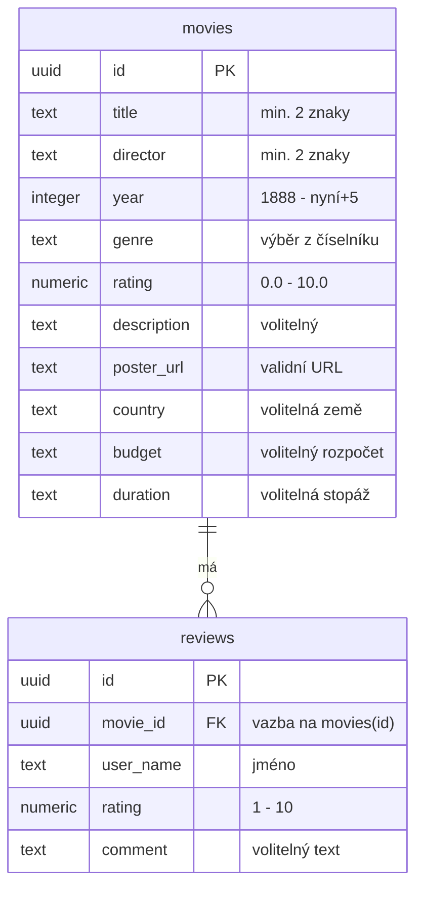
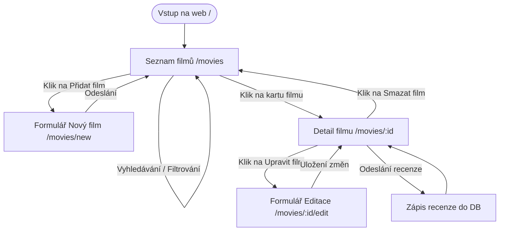

# CineVault – Filmová knihovna s integrací Supabase API
## Technická dokumentace a návrh webové aplikace

**Autoři:** Volodymyr Panovyk, Oleksandr Bukrieiev  
**Třída:** I3C  
**Předmět:** Tvorba webových aplikací  
**Vyučující:** Sergey Kuroedov  
**Školní rok:** 2025/2026  

---

## Obsah
1. **Úvod**
2. **Research (Průzkum trhu)**
3. **Analýza požadavků**
4. **Návrh funkcí systému (Role a User Stories)**
5. **Návrh řešení (Architektura, DB, User Flow)**
6. **Implementace**
7. **Porovnání návrhu a implementace**
8. **Závěr**

---

## 1. Úvod

V dnešní digitální éře čelí filmoví diváci fragmentaci streamovacích služeb (Netflix, HBO, Disney+), což ztěžuje udržení přehledu o zhlédnutých filmech. Cílem tohoto projektu je vytvořit aplikaci **CineVault**, která slouží jako osobní, nezávislá a uživatelsky přívětivá filmová knihovna. 

Téma projektu demonstruje moderní webové technologie v praxi. Aplikace poskytuje čisté rozhraní bez reklam, které uživateli umožňuje plnou kontrolu nad filmovými záznamy.

**Cíl aplikace:** 
Hlavním cílem aplikace CineVault je poskytnout uživatelům nástroj pro správu (CRUD operace) katalogu filmů s možností vyhledávání, filtrování podle žánrů, podrobných produkčních informací a psaní recenzí.

**Cílová skupina:**
Cílovou skupinou jsou filmoví nadšenci (cinefilové) a běžní diváci, kteří chtějí mít přehledný digitální deník svých filmových zážitků.

---

## 2. Research (Průzkum trhu)

Před zahájením návrhu a vývoje byla provedena analýza stávajících platforem: IMDb, Letterboxd a ČSFD.

### IMDb (Internet Movie Database)
* **Výhody:** Obrovské množství dat, detailní biografie tvůrců, globální standard.
* **Nevýhody:** Uživatelské rozhraní je přeplněné reklamami a proces přidávání hodnocení či seznamů je zdlouhavý.

### Letterboxd
* **Výhody:** Vynikající moderní vizuální design, silný sociální aspekt (sdílení recenzí, diskuse).
* **Nevýhody:** Platforma je primárně sociální sítí, což nemusí vyhovovat lidem hledajícím soukromí. Pokročilé statistiky jsou zpoplatněny.

### ČSFD (Česko-Slovenská filmová databáze)
* **Výhody:** Rozsáhlá lokální komunita v ČR/SR, kvalitní české popisy filmů.
* **Nevýhody:** Uživatelské rozhraní je zastaralé, web trpí agresivní reklamou a chybí možnost správy soukromé knihovny.

### Vymezení CineVault vůči konkurenci
CineVault se odlišuje tím, že je koncipován jako **osobní trezor (Vault)**. Neobsahuje reklamy, načítá se okamžitě a poskytuje čisté rozhraní zaměřené pouze na uživatelské záznamy.

---

## 3. Analýza požadavků

### Funkční požadavky
1. **Správa záznamů (CRUD):** Vytvoření filmu (včetně 10 doplňujících polí jako země, rozpočet, stopáž), zobrazení detailů v tabulce, editace a smazání s potvrzením.
2. **Uživatelské recenze:** Psaní recenzí na detailu filmu (jméno autora, hodnocení 1–10 hvězd, volitelný komentář) s dynamickým načítáním.
3. **Vyhledávání a filtrace:** Fulltextové vyhledávání v reálném čase a filtrování seznamu podle žánrů.
4. **Validace dat:** Okamžitá kontrola vstupů formuláře na straně klienta.

### Nefunkční požadavky
1. **Responzivita:** Přizpůsobení rozhraní všem typům displejů (Mobile-First).
2. **Výkon a odezva:** Asynchronní operace bez znatelných prodlev (odezva do 200 ms).
3. **Bezpečnost dat:** Využití cloudového úložiště Supabase s definovanou politikou Row Level Security (RLS) pro veřejný anonymní přístup.
4. **Estetická úroveň:** Glassmorphismus, gradienty, tmavý režim pro moderní vzhled.

---

## 4. Návrh funkcí systému (User Stories a role)

### Uživatelské role
1. **Návštěvník / Uživatel:** Osoba přistupující na web. Má plná práva pro prohlížení katalogu, správu filmů a psaní recenzí bez nutnosti registrace.
2. **Administrátor:** Správce systému moderující obsah v databázové konzoli.

### Uživatelské scénáře (User Stories)
* *„Jako uživatel chci vidět přehlednou mřížku filmů s plakáty, abych měl vizuální přehled.“*
* *„Jako uživatel chci na detailu filmu vidět přehlednou tabulku podrobností (země, rozpočet, stopáž), abych získal rychlé informace.“*
* *„Jako uživatel chci napsat k filmu recenzi s mým jménem, abych se podělil o své dojmy.“*
* *„Jako uživatel chci vyhledávat a filtrovat filmy podle žánrů, abych rychle našel konkrétní film.“*
* *„Jako uživatel chci upravit nebo smazat film, abych mohl opravit chyby.“*

---

## 5. Návrh řešení

### Architektura systému
Next.js (App Router, JavaScript) s klientskými komponentami (`'use client'`). Pro ukládání dat slouží databáze **Supabase** (PostgreSQL).

### Databázový model (ERD)
Aplikace pracuje se dvěma tabulkami propojenými vazbou 1:N:



### Uživatelský průchod aplikací (User Flow)


### Návrh uživatelského rozhraní
* **Hlavní přehled (`/movies`):** Tmavá fixní lišta, ovládací panel s vyhledáváním a žánrovým filtrem. Spodní část tvoří responsivní mřížka karet filmů.
* **Detail filmu (`/movies/[id]`):** Dvousloupcové rozložení. Vlevo plakát, vpravo název, popis, strukturovaná mřížka „O filmu“ (kde se prázdná pole neskreslují) a sekce recenzí s formulářem.

---

## 6. Implementace

### Správa dat s využitím Supabase API
Propojení s PostgreSQL databází bylo realizováno pomocí `lib/supabase.js`. SQL operace probíhají asynchronně na straně klienta:
- **Čtení:** `supabase.from('movies').select('*')` a recenze pomocí `.eq('movie_id', id)`.
- **Zápis:** `.insert([payload])` do tabulek `movies` a `reviews`.

### Klientská validace (React Hook Form & Zod)
Formulář využívá integraci `react-hook-form` a validátoru `Zod` pomocí resolveru. Validační schéma `lib/schemas.js` vynucuje integritu dat.

Ukázka validačního schématu:
```javascript
export const movieSchema = z.object({
  title: z.string().trim().min(2).max(100),
  director: z.string().trim().min(2).max(100),
  year: z.coerce.number().int().min(1888).max(new Date().getFullYear() + 5),
  genre: z.string().min(1),
  rating: z.coerce.number().min(0).max(10),
  description: z.string().max(1000).optional().or(z.literal('')),
  poster_url: z.string().url().optional().or(z.literal('')),
  // Ostatní doplňující pole (country, slogan, budget atd.) jsou volitelná
});
```

---

## 7. Porovnání návrhu a implementace

### Odchylky od původního návrhu
1. **Absence uživatelské autentizace:** Původní ideální návrh počítal s registrací uživatelů. Pro účely snadné prezentace bez přihlašovací bariéry byla autentizace vynechána. Všechny operace jsou veřejné a sdílené.
2. **Přidání recenzí jako kompenzace:** Pro zvýšení interaktivity aplikace byla přidána možnost psaní anonymních recenzí, což proměnilo pasivní seznam na komunitní katalog.
3. **Rozšíření metadat (Factsheet):** Pro realističtější dojem filmové databáze jsme přidali 10 nových parametrů (slogan, scénář, rozpočet atd.) a na detailu implementovali přehlednou sekci „O filmu“.

### Kompromisy
* **Ruční zadávání odkazů na plakáty:** Z důvodu limitů bezplatných API klíčů uživatel zadává odkaz na obrázek ručně, případně systém vykreslí náhradní SVG grafiku.

---

## 8. Závěr

Projekt **CineVault** splnil všechny cíle. Byla vytvořena plně responzivní Next.js aplikace propojená se vzdálenou databází Supabase, s klientskou validací formulářů a tmavým vzhledem.

### Dosažené výsledky
- Plná implementace CRUD operací s cloudovou synchronizací.
- Funkční asynchronní systém recenzí a hodnocení.
- Validace formulářů pomocí knihovny Zod chránící integritu dat.
- Verzování projektu pomocí Gitu.

### Limity projektu a budoucí rozšíření
Hlavním limitem je chybějící autorizace (každý může smazat cokoliv). Do budoucna lze aplikaci rozšířit o **Supabase Auth** pro registraci uživatelů, integraci **TMDb API** pro automatické vyhledávání plakátů a výpočet průměrného hodnocení.
